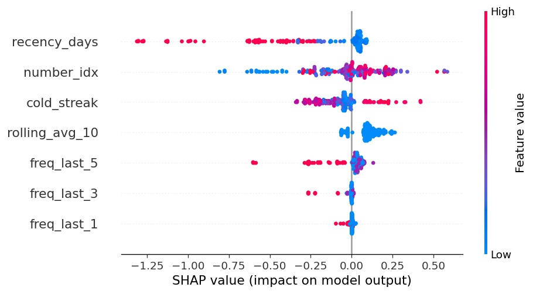
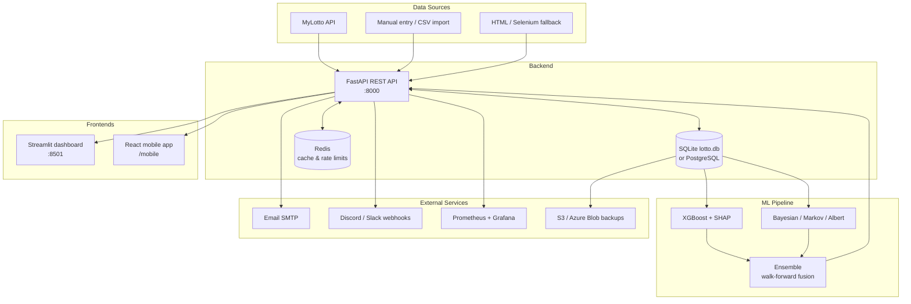

# Lotto Wheel App — NZ Lotto Powerball Analysis & Prediction Platform

[](https://github.com/nemo-alkey/D-lotto-wheel-app/actions/workflows/ci.yml)
[](docs/CHANGELOG.md)
[](LICENSE)
[](https://www.python.org/)

A mathematically grounded platform for NZ Lotto Powerball (6/40 + Bonus 1–40 +
Powerball 1–10): abbreviated wheel generation with guaranteed minimum wins,
ML-driven predictions, historical backtesting with jackpot rollover, and a
full observability stack.


<!-- Drop a dashboard screenshot at docs/assets/dashboard.png and add it here. -->

---

## Quick Start

```bash
git clone https://github.com/nemo-alkey/D-lotto-wheel-app.git && cd D-lotto-wheel-app
pip install -r requirements.txt && cp .env.example .env
bash start.sh        # dashboard → http://localhost:8501, API → http://localhost:8000
```

`start.sh` installs dependencies, runs migrations, and starts both the
Streamlit dashboard and the FastAPI server. Prefer Docker? See
[Installation](#installation).

---

## Features

- 🎡 **Bluskov wheel library** — five pre-built wheels with proven covering guarantees (`single1`, `single2`, `double`, `five-if-six`, `jackpot7`)
- 🛠️ **Custom wheel builder** — abbreviated wheels for any 6–20 number pool, include/exclude, bonus coverage, GA auto-optimization
- 🤖 **ML predictions** — XGBoost with SHAP explanations, hierarchical Bayesian bonus predictor, dynamic ensemble with walk-forward calibration
- 📊 **Backtesting engine** — multi-draw simulation with $50M jackpot cap, rollover, forced distribution, bootstrap CIs, paired t-tests
- 🎱 **Bonus analytics** — frequency, gap analysis, bonus–main co-occurrence heatmaps and triplets
- 🖥️ **25+ page Streamlit dashboard** — analysis, predictions, backtests, live monitor, system health
- 📱 **React mobile frontend** — Vite build served at `/mobile`
- 🔌 **40+ endpoint REST API** — FastAPI with Swagger/ReDoc docs, JWT auth, rate limiting
- 🔐 **Security hardened** — bcrypt, refresh tokens, account lockout, security headers, audit logging ([SECURITY.md](SECURITY.md))
- 📈 **Observability** — Prometheus `/metrics`, health checks, JSON logs, Grafana stack, email/webhook alerts
- 💾 **Automated backups** — SQLite Online Backup API, gzip + retention, optional S3/Azure off-site copies
- 🗄️ **SQLite or PostgreSQL** — SQLAlchemy Core, Alembic migrations
- 🧾 **Syndicates** — shared tickets, member management, winner notifications
- 🌍 **International lotteries** — US Powerball, Mega Millions, EuroMillions results

---

## Architecture



Deep dive: [docs/ARCHITECTURE.md](docs/ARCHITECTURE.md) ·
Predictions: [docs/ML_PIPELINE.md](docs/ML_PIPELINE.md) ·
Wheel math: [docs/MATHEMATICAL_GUARANTEES.md](docs/MATHEMATICAL_GUARANTEES.md)

---

## Installation

### Local (venv)

```bash
python -m venv venv
source venv/bin/activate          # Windows: venv\Scripts\activate
pip install -r requirements.txt
cp .env.example .env              # then edit .env — set a real SECRET_KEY
python migrate.py upgrade         # create/update database schema
python update_draws.py            # seed draw history

streamlit run dashboard.py        # dashboard → :8501
uvicorn api:app --port 8000       # API → :8000
```

### Docker

```bash
docker compose up --build         # app + redis + nginx

docker compose exec app pytest    # run tests inside the container
docker compose logs -f app        # follow logs
```

| Service   | URL                       | Notes                                        |
|-----------|---------------------------|----------------------------------------------|
| Dashboard | http://localhost:8501     | Streamlit                                    |
| API       | http://localhost:8000     | FastAPI (`/health`, `/docs`, `/metrics`)     |
| nginx     | http://localhost:8080     | `/` dashboard, `/api/` API, `/mobile/` build |
| redis     | internal                  | rate limiting / caching                      |

Optional observability stack (Prometheus :9090, Grafana :3000):

```bash
docker compose -f docker-compose.monitoring.yml up -d
```

`docker-compose.override.yml` auto-loads for local dev (bind-mounted source,
`DEBUG=true`, hot reload). Bypass it with
`docker compose -f docker-compose.yml up --build` for a production-style run.

### Windows notes

- Use **Git Bash** or WSL for `start.sh` and the Makefile; in PowerShell run
  the manual steps (`venv\Scripts\Activate.ps1`, then the commands above).
- If activation is blocked: `Set-ExecutionPolicy -Scope CurrentUser RemoteSigned`.
- Paths: the project assumes the working directory is the repo root — run all
  commands from there (`D:\lotto-wheel-app`).
- `make` is not installed by default on Windows — use `winget install GnuWin32.Make`,
  or just run the underlying commands shown in `make help`.

---

## Configuration

All configuration is environment-driven. Canonical, type-safe app config lives
in `config/settings.py` (pydantic-settings, validated at startup); copy
`.env.example` to `.env` and edit. Legacy names in parentheses still work.

### Core app config (`config/settings.py`)

| Variable | Default | Description |
|---|---|---|
| `SECRET_KEY` | *(insecure dev default)* | JWT signing secret, **min 32 chars**. Boot fails in production if unchanged. (alias `JWT_SECRET_KEY`) |
| `DEBUG` | `false` | Dev mode. `false` enables the production config guard |
| `DATABASE_URL` | `sqlite:///data/lotto.db` | SQLAlchemy URL (`postgresql://…` supported) |
| `DB_PATH` | `lotto.db` | SQLite file path used by the API |
| `DB_POOL_SIZE` | `5` | Connection pool size |
| `API_HOST` / `API_PORT` | `0.0.0.0` / `8000` | API bind address |
| `CORS_ORIGINS` | `http://localhost:5173,http://127.0.0.1:5173` | Comma-separated allowed origins (never `*` in production) |
| `INTERNAL_NOTIFY_TOKEN` | — | Shared secret for `POST /internal/new-draw` |
| `RATE_LIMIT_ENABLED` | `true` | Master switch for API rate limiting |
| `RATE_LIMIT_REQUESTS` / `RATE_LIMIT_WINDOW` | `60` / `60` | Requests per window (seconds) |
| `REDIS_URL` | `redis://localhost:6379` | Cache/rate-limit backend (in-memory fallback) |
| `SMTP_HOST` / `SMTP_PORT` | — / `587` | Alert email server (aliases `SMTP_SERVER`, …) |
| `SMTP_USER` / `SMTP_PASS` | — | SMTP credentials (aliases `SMTP_USERNAME`/`SMTP_PASSWORD`) |
| `ALERT_WEBHOOK_URL` | — | Discord/Slack incoming webhook for alerts |
| `BACKUP_ENABLED` | `true` | Master switch for scheduled backups |
| `BACKUP_RETENTION_DAYS` | `30` | Delete backups older than this |

### JWT / auth

| Variable | Default | Description |
|---|---|---|
| `JWT_EXPIRE_MINUTES` | `15` | Access token lifetime |
| `JWT_REFRESH_EXPIRE_DAYS` | `7` | Refresh token lifetime |
| `JWT_ALGORITHM` | `HS256` | Signing algorithm |
| `ADMIN_USERNAME` / `ADMIN_PASSWORD` | `admin` / `admin` | Initial admin account — change in production |

### Monitoring & backups

| Variable | Default | Description |
|---|---|---|
| `LOTTO_API_URL` | `http://localhost:8000` | API base for the dashboard health page |
| `PROMETHEUS_URL` | — | Enables the 24h error-rate chart |
| `BACKUP_DIR` | `backups` | Backup destination |
| `BACKUP_COMPRESS_AFTER_DAYS` | `7` | Gzip backups older than this |
| `BACKUP_SCHEDULE` | `02:00` | Daily backup time (HH:MM) |
| `BACKUP_S3_BUCKET` | — | Off-site S3 copies (uses AWS creds) |
| `BACKUP_AZURE_CONTAINER` | — | Off-site Azure Blob copies |

### Lottery behaviour (legacy `settings.py`)

| Variable | Default | Description |
|---|---|---|
| `PRIZE_POOL_RATIO` | `0.75` | Fraction of turnover going to prizes |
| `DIV1_CAP` | `50000000` | Max Div 1 payout per winner (NZD) |
| `MAX_CONSECUTIVE_JACKPOTS` | `10` | Rollovers before a must-win draw |
| `DIV7_PB_PRIZE` / `DIV7_LOTTO_PRIZE` | `15.0` / `2.80` | Fixed Div 7 prizes |
| `TICKET_COST` | `1.50` | Cost per ticket line (NZD) |
| `DRAWS_PER_WEEK` | `2` | NZ Lotto draws per week |

### Data fetching & misc

| Variable | Default | Description |
|---|---|---|
| `API_BASE` | `https://pathway.mylotto.co.nz` | MyLotto API base URL |
| `API_TIMEOUT` / `POLITE_DELAY` | `15` / `2.0` | Request timeout / delay between fetches |
| `CACHE_TTL_DAYS` / `CACHE_TTL_SECONDS` | `7` / `3600` | Prize cache / Streamlit cache TTLs |
| `SELENIUM_CHROME_BINARY` | — | Chrome binary for the Selenium fallback |
| `USE_SELENIUM_FALLBACK` | `false` | Enable Selenium scraper as last resort |
| `API_RATE_LIMIT` / `HEAVY_RATE_LIMIT` | `60/minute` / `5/minute` | slowapi limit strings |
| `SMTP_FROM` / `ALERT_EMAIL_TO` | — | Alert sender / recipient overrides |
| `PRIZE_CACHE_FILE` / `ALERT_LOG` | `prize_cache.json` / `alert.log` | File paths |

---

## Usage

### Generating wheels

**Dashboard:** open the *Custom Wheel Builder* page, pick a pool (or let it use
the hot numbers), choose a guarantee, generate.

**API:**

```bash
curl -X POST http://localhost:8000/wheels/generate \
  -H "Content-Type: application/json" \
  -d '{"pool_size": 10, "guarantee_type": "4 if 4"}'
```

**CLI:**

```bash
python main.py                                  # interactive menu
python main.py optimize-wheel --generations 30  # GA-optimized parameters
```

### Running backtests

```bash
# Single wheel over history, with bonus-impact report
python backtest.py --wheel single1 --draws 500

# Multi-draw with jackpot rollover
python backtest.py --wheel jackpot7 --multi --num-draws 20 --start-draw 100

# Via the API (date-bounded)
curl -X POST http://localhost:8000/backtest \
  -H "Content-Type: application/json" \
  -d '{"start_date": "2025-01-01", "end_date": "2025-12-31", "wheel_type": "single1"}'
```

### Understanding predictions

`POST /predictions` accepts three methods:

- **`frequency`** — appearance counts over the last 30 draws. Transparent, fast,
  good baseline.
- **`ensemble`** — dynamic fusion of Bayesian, Markov, and Albert sub-predictors
  with weights calibrated by walk-forward validation. The recommended default.
- **`ml`** — trained XGBoost model (requires `model.pkl`; run
  `python train_ml_model.py` first).

Every response includes per-number probabilities. Treat them as *rankings*,
not certainties — see [docs/ML_PIPELINE.md](docs/ML_PIPELINE.md) for how the
models are trained and evaluated, and
[docs/MATHEMATICAL_GUARANTEES.md](docs/MATHEMATICAL_GUARANTEES.md) for what
wheel guarantees do and don't promise.

### Syndicate setup

1. Dashboard → **👥 Syndicates** page (or the `syndicate.py` module).
2. Create a syndicate, add members with their shares.
3. Assign wheels/tickets to the syndicate — tickets are stored in
   `syndicate_tickets` and checked automatically by the scheduler.
4. Win notifications email each member their share
   (`notifier.send_email_to`), configurable under **Notification Settings**.

---

## API Documentation

Interactive docs are served by the running API:

| URL | Description |
|---|---|
| http://localhost:8000/docs | Swagger UI — try endpoints interactively |
| http://localhost:8000/redoc | ReDoc reference |
| http://localhost:8000/docs/custom | ReDoc with the dashboard's dark theme |
| http://localhost:8000/openapi.json | OpenAPI schema (with examples) |
| http://localhost:8000/health | System health (DB, Redis, disk, memory, draw age, backups) |
| http://localhost:8000/metrics | Prometheus metrics |

Auth: `POST /register` → `POST /token` (returns access + refresh tokens) →
send `Authorization: Bearer <access_token>`. Refresh with `POST /token/refresh`.
Protected endpoints show a lock icon in Swagger UI.

---

## Testing

```bash
make test               # full suite (tests/ + legacy test_lotto.py)
make test-unit          # unit tests only
make test-integration   # integration tests (spins up temp DBs)
make lint               # ruff
```

CI runs the suite on Ubuntu (Python 3.11/3.12) and Windows, plus a `pip-audit`
dependency vulnerability scan. 250+ tests.

---

## Deployment

Full guides: **[docs/DEPLOYMENT.md](docs/DEPLOYMENT.md)**. Short version:

- **Docker** (recommended): `docker compose -f docker-compose.yml up -d` —
  non-root image, migrations on boot, SQLite on a named volume, Redis included.
- **AWS**: ECS/Fargate service behind an ALB, secrets in Secrets Manager,
  backups to S3 (`BACKUP_S3_BUCKET`).
- **Azure**: Container Apps + Azure Blob (`BACKUP_AZURE_CONTAINER`), or App
  Service with the Docker image.
- **Render**: one web service from the Dockerfile, disk mounted for `lotto.db`,
  env vars from the dashboard.

Production checklist: real `SECRET_KEY`, `DEBUG=false`, explicit
`CORS_ORIGINS`, SMTP or webhook alerts, `database_backup.py backup` on a
schedule. The app **refuses to boot** with a placeholder secret in production.

---

## Contributing

See [CONTRIBUTING.md](CONTRIBUTING.md) for architecture orientation. Ground rules:

- **Branches:** `feature/<name>`, `fix/<name>`, `docs/<name>` off `main`.
- **PRs:** small and focused; include tests for behavior changes; CI must be
  green (lint + tests + pip-audit).
- **Code style:** `black` formatting, `ruff check . --ignore=F401,E402`,
  Google-style docstrings for public functions.
- **Commits:** imperative mood, reference issues (`Fix #123`).

---

## License

MIT — see [LICENSE](LICENSE).

---

## Acknowledgments

- **Iliya Bluskov** — the combinatorial covering designs (wheels) at the core
  of this project.
- **"Albert's Lotto Code"** — positive/negative, block, sum-range, and
  numerical-attraction analysis methods.
- MyLotto NZ for the public draw data.
- Open-source libraries: FastAPI, Streamlit, pandas, scikit-learn, XGBoost,
  SHAP, SQLAlchemy, Alembic, pydantic, slowapi, prometheus-client, and more
  (see `requirements.txt`).

*This software is for analysis and education. Lottery draws are random — no
system changes the odds of any single ticket. Play responsibly.*
