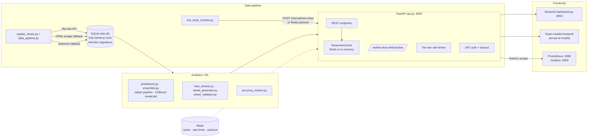

# Architecture

This document explains the major design decisions in the Lotto Wheel App: what was
chosen, why, and what trade-off each choice accepts. For setup and usage see the
[README](../README.md); for API surface details see `/docs` on a running instance.

## 1. System layering

The platform is a single-process-friendly monolith with four layers. Data flows
one way: draws are ingested, stored, analysed, and served; the frontends are
read-only consumers of the API and database.

**Decision:** keep everything in one Python codebase and (by default) one
container, with clean module boundaries between layers.

**Rationale:** the workload is small (one draw twice a week, batches of
predictions), the operators are typically solo, and a monolith removes all
distributed-systems failure modes. The boundaries (pipeline → DB → analytics →
API) still exist so pieces can be split out later.

**Trade-off:** no independent scaling of layers, and a heavy prediction request
shares the event loop/process budget with everything else. Accepted because the
heavy endpoints are rate-limited and cached (see §4–5).

## 2. Persistence: SQLite + SQLAlchemy Core

**Decision:** the primary store is a single SQLite file (`lotto.db`) accessed
through SQLAlchemy Core (`database_engine.py`), with Alembic migrations driven
by `migrate.py` (`upgrade` / `downgrade` / `stamp` / `current` / `history` /
`check`). Setting `DATABASE_URL=postgresql://…` switches to PostgreSQL without
code changes.

For SQLite the engine uses `check_same_thread=False` with a `StaticPool` (one
shared connection — SQLite gains nothing from a pool) and sets WAL-friendly
pragmas on connect. PostgreSQL gets a real pool (`pool_size=5`,
`pool_pre_ping=True`).

**Rationale:** SQLite has zero operational footprint — no server, no extra
container (`docker-compose.yml` deliberately has no `db` service; the DB file
lives on the `lotto-data` volume). SQLAlchemy Core keeps SQL explicit while
abstracting dialect differences, so the PostgreSQL path is a config change, not
a rewrite.

**When to switch to PostgreSQL:** when you need concurrent writers (multiple
API workers or external tools writing while the API serves), network access to
the DB, row-level locking, or managed backup/replication. SQLite's single-writer
lock is the real ceiling; read concurrency in WAL mode is fine.

**Trade-off:** SQLite lacks true concurrent writes and some types/features;
the code compensates with short transactions and the Online Backup API (§9).

## 3. Multi-source fetch fallback chain

**Decision:** `update_draws.py` fetches draws from the official MyLotto API
(`https://pathway.mylotto.co.nz/api/results/v1/results/lotto`) with exponential
backoff retries; if the API keeps failing it falls back to the HTML scraper
(`html_scraper.py`, BeautifulSoup), and if that also fails and Selenium is
enabled (`USE_SELENIUM_FALLBACK` or `--use-selenium`), to a headless browser
(`selenium_scraper.py`). `python update_draws.py --check-selenium` validates the
browser setup without scraping.

**Rationale:** the API is fast and structured but unofficial and subject to
change; HTML scraping survives API renames but breaks on markup changes;
Selenium is slow and heavyweight but renders the real page and is the last
resort. Ordering by cost/fragility keeps the common path cheap.

**Trade-off:** three parsers to maintain for the same logical entity. Mitigated
by normalising everything into one draw dict before it touches the DB, and by
making Selenium opt-in so a plain install needs no browser driver.

## 4. Caching strategy

**Decision:** a small `ResponseCache` wrapper in `api.py` with two backends:
Redis when reachable (`REDIS_URL`), otherwise per-process `cachetools.TTLCache`
(maxsize 128 per namespace). Two TTLs only:

- `TTL_PREDICTIONS = 300` seconds — prediction responses (`/predictions` etc.)
- `TTL_ANALYTICS = 3600` seconds (1 hour) — analytics responses

Responses carry a `cache` block (`hit`, `ttl`, `backend`) so clients can see
what happened.

**Rationale:** prediction inputs only change when a new draw lands (twice a
week), so even a 5-minute TTL absorbs nearly all repeated computation while
keeping staleness invisible in practice. Redis makes the cache shared across
workers and survives restarts; the in-memory fallback keeps a bare
`python api.py` dev setup fully functional with zero dependencies.

**Trade-off:** with the in-memory fallback, each uvicorn worker caches
independently (duplicate work, per-worker staleness). TTL expiry is the only
invalidation — acceptable because the underlying data changes so rarely.

## 5. Two-tier rate limiting

**Decision:** slowapi with a custom key function: requests with a valid JWT are
keyed as `user:<name>` and get 60/minute; everyone else is keyed as
`ip:<address>` and gets 10/minute. Expensive endpoints (`ev_simulation`,
`bonus_impact`, wheel generation) are additionally capped at 5/minute, and login
endpoints at 5/minute per IP. A middleware (`two_tier_rate_limit`) enforces the
tier limit; all 429 responses include a `Retry-After` header. Limiter storage is
Redis when available, `memory://` otherwise; `RATE_LIMIT_ENABLED=false` disables
the middleware.

**Rationale:** anonymous abuse is the main threat, so it gets the tight limit;
authenticated users are accountable and get headroom. Keying by user (not IP)
for token holders avoids penalising many users behind one NAT. Login gets its
own per-IP limit because that is where credential stuffing happens.

**Trade-off:** with in-memory storage, limits are per-process — N workers allow
roughly N× the stated rate. Per-user keying trusts the JWT's signature, which is
fine since forged tokens fail verification and fall back to the IP bucket.

## 6. Authentication design

**Decision:** OAuth2 password flow at `/token`, JWT (HS256) access tokens
(15 min) plus refresh tokens (7 days) at `/token/refresh`. Every token carries a
`type` claim (`access` or `refresh`); `verify_refresh_token` rejects
`type != "refresh"`, so a refresh token can never be used as an access token and
vice versa. Passwords are hashed with bcrypt directly (not passlib — passlib
1.7.4 is incompatible with bcrypt ≥5; the `$2b$` format is identical, so old
passlib hashes still verify). bcrypt's 72-byte input limit is handled by
explicit truncation, and passwords are capped at 128 bytes at validation.

**Account lockout:** after 5 failed logins in a rolling 30-minute window the
account is locked. The failure log is **in-memory** (a dict guarded by a
`threading.Lock`), not in the database.

**Rationale for in-memory lockout:** zero schema churn, no write amplification on
the login hot path, and lockouts are inherently transient — there is no value in
persisting them across restarts.

**Trade-off:** lockout state is per-process and resets on restart; with multiple
workers an attacker gets up to 5 attempts per worker. Judged acceptable for a
single-container deployment combined with the 5/min per-IP login rate limit. If
the app ever runs multi-worker at scale, this state should move to Redis or the
users table.

## 7. Configuration architecture

**Decision:** two settings modules with a deliberate split of ownership:

- `config/settings.py` — **canonical**, typed app-runtime config via
  pydantic-settings: secrets, server, CORS, rate limiting, Redis, notifications,
  backups. Reads `.env`, uppercase env vars, `case_sensitive=True`.
- root `settings.py` — legacy lottery-domain tuning (prize pools, division caps,
  JWT lifetimes) kept for backward compatibility with older modules.

**Alias strategy:** renamed variables still work through pydantic
`AliasChoices` — `SECRET_KEY` also accepts `JWT_SECRET_KEY`; `SMTP_HOST` /
`SMTP_USER` / `SMTP_PASS` accept `SMTP_SERVER` / `SMTP_USERNAME` /
`SMTP_PASSWORD`. Old deployments keep working without renaming anything.

**Startup validation:** the `Settings` singleton fails fast at import (exit 1
with a readable message) on invalid env values such as a sub-32-char
`SECRET_KEY`. On top of that, `config_manager.validate_startup()` — called from
the FastAPI lifespan — refuses to boot in production (`DEBUG=false`) with a
placeholder `SECRET_KEY` or a wildcard CORS origin, and warns when `DEBUG=true`
has no localhost origin (looks like prod accidentally running in debug).

**Rationale:** one typed source of truth kills scattered `os.environ` reads;
the insecure-but-recognisable default secret means imports never crash without a
`.env`, while validation guarantees it can never reach production. `.env.example`
documents every variable.

**Trade-off:** two settings modules is confusing until you know the split; the
legacy module exists purely to avoid a flag-day refactor of older code.

## 8. Observability

**Decision:** three mechanisms in the `monitoring/` package:

1. **Scrape-time health collector** — `metrics.HealthCollector` runs the health
   checks (database, Redis, disk, memory, backup freshness, last-draw age)
   *inside* Prometheus's `/metrics` scrape and exports them as gauges. There is
   no background thread keeping metrics fresh.
2. **Structured JSON logs** — `logging_setup.JsonFormatter` emits single-line
   JSON with request-scoped context (request ID, user) bound per request.
3. **Duplicated alert evaluation** — the same thresholds exist in
   `monitoring/alerts.yml` (Prometheus rule files: 5xx > 1% for 5m, prediction
   p95 > 5 s for 10 m, DB down for 2 m, draw stale > 72 h, disk > 90%) **and** in
   `monitoring/alerting.py`, which evaluates them app-side via
   `python -m monitoring.alerting` and dispatches email (`notifier.py`, SMTP_*)
   or a Discord/Slack webhook (`ALERT_WEBHOOK_URL`).

**Rationale:** scrape-time collection means health data is only computed when
someone asks — no stale snapshots, no extra threads, and a down app is itself
the signal (scrape fails). Duplicating the alert rules is deliberate: Prometheus
+ Alertmanager is optional (started via `docker-compose.monitoring.yml`), and a
minimal deployment still gets alerts from the app-side evaluator.

**Trade-off:** two rule implementations to keep in sync — the header comment in
`alerts.yml` explicitly says so. Scrape-time checks also add latency to
`/metrics`; kept small by cheap checks and short socket timeouts.

## 9. Backup strategy

**Decision:** `database_backup.py` snapshots the database with SQLite's **Online
Backup API** (`Connection.backup`), so a consistent copy is taken while the API
keeps serving — no downtime, no file-copy races. Every backup is verified with
`PRAGMA integrity_check`. Retention is tiered:

- fresh backups kept as plain `.db` files for 7 days (`BACKUP_COMPRESS_AFTER_DAYS`),
- gzip-compressed after that,
- deleted after 30 days (`BACKUP_RETENTION_DAYS`).

CLI: `backup [--now]`, `restore <file> [--target]`, `list [--days N]`,
`verify <file>`, and `daemon` (daily at `BACKUP_SCHEDULE`, default 02:00).
Restore is defensive: it snapshots the current DB to `<name>.restore-<timestamp>`
before overwriting. Optional off-site copies go to S3 (`BACKUP_S3_BUCKET`) or
Azure Blob (`BACKUP_AZURE_CONTAINER`); failures email via `notifier.py`. Logs go
to `data/logs/backup.log`.

**Rationale:** the Online Backup API is the only copy method that is both
consistent and non-blocking for SQLite. Tiered gzip retention keeps recent
backups instantly restorable while bounding disk use.

**Trade-off:** local backups share fate with the host unless S3/Azure is
configured — off-site is opt-in, not default.

## 10. Concurrency & deployment model

**Decision:** one Docker image, one container, two processes. The multi-stage
`Dockerfile` (build deps in a `builder` stage, slim runtime, non-root user
`lotto`) ends in `supervisord`, which runs both `uvicorn api:app --port 8000`
and `streamlit run dashboard.py --port 8501` with autorestart and 10-second
graceful SIGTERM drains. `scripts/docker-entrypoint.sh` runs Alembic migrations
at boot so the schema is always current. `docker-compose.yml` adds Redis
(appendonly persistence) and an nginx reverse proxy on :8080 (dashboard at `/`,
API at `/api/`, mobile at `/mobile/`); `docker-compose.override.yml` layers dev
hot-reload with `DEBUG=true`.

**Live-draw broadcast:** WebSocket clients connect to `/ws/live-draw`, tracked by
an in-process `ConnectionManager`. Draw events enter two ways: an authenticated
HTTP hook (`POST /internal/new-draw`) or, when Redis is up, a pub/sub relay — a
lifespan task subscribes to the `lotto:draw-events` channel and re-broadcasts to
local sockets. The Redis bridge is best-effort: if Redis is down the HTTP hook
still works, so realtime updates degrade, not break.

**Rationale:** supervisord-in-one-container matches the "single operator, single
host" reality — one `docker compose up` gives the whole stack. The Redis pub/sub
relay exists because publishers (`live_draw_monitor.py`, `update_draws.py`) run
as separate processes and cannot call the in-process broadcast directly.

**Trade-off:** the default single uvicorn worker serialises CPU-bound
predictions against request handling; scaling to `--workers N` (or gunicorn)
works but makes the in-memory cache, rate limits, lockout, and WebSocket manager
per-process — Redis-backed modes are the intended answer for each, except the
lockout (§6). Running two apps in one container also violates the
one-process-per-container purist view; accepted for operational simplicity.
